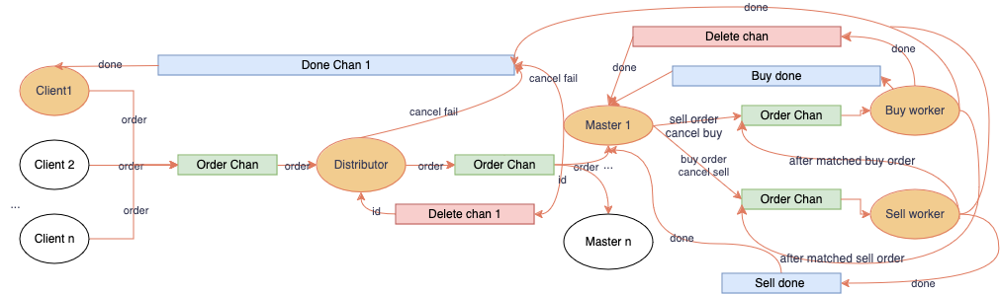

# Exchange matching engine in Go

### Contributors

1. Nguyen Quy Duc
2. Tran Nhan Duc Anh

### I. Architecture

The diagram above illustrates how we structure the program. Each component (`Client`, `Distributor`, `Workers`) is handled by a goroutine. The goroutines do not maintain any shared data structures but instead communicate through go channels (`Order chan`, `delete chan`, `done channel`) to maintain their own version of data structures (`map`, `variable`). The common channels are created by the first component that need and passed around through a struct `Order` or shared when initializing the components. 

**Basic flow of how thing works:** When initialize, the engine have ONE center `distributor`. When the engine receive a new connection, a go routine is spawned to serve as the new `client` to send orders to the `distributor`. The `distributor` then send orders to compatible existing set of `workers` (existing instruments) or create a new set or workers (`master`, `buyer`, `seller`) and add to the map. The orders are then served among the workers (to be discussed further below).

### II. Handle request from multiple clients concurrently

1. **Clients->Distributor**

For each `Client`, a goroutine is spawned to read inputs and send orders to the `Distributor` through one single channel. The orders within a client is serialized and cannot be reordered (This is archieved by `client` acknowledging order is processed from only **SINGLE** `worker` through a `done chan` corresponding to the previous order). When the `Distributor` receive an order from `Client`, it doesn't wait but continously distributes to corresponding instrument `master_workers`.

2. **Phase-level concurrency**

For each instrument, 1 `master_worker`, 1 `buyer_worker` and `seller_worker` are spawned. The go channel to `master` is created and maintained in `distributor`. Orders of different instruments get sent to different `master` and there is no communication between 2 or more `master`s. This ensures **instrument-level concurrency** in the design.

**Phase-level concurrency** (orders from different types can be executed concurrently) is achived through 3-workers design for each instrument. The workflow inside a set of 3 workers (refer to diagram above) can be shortly described as follow. For example, 
- New sell order (*buy order can be similarly inferred*): 
  - The `master`, when receives a sell order from the `distributor`, store the *InputType* of the order in a map, and send to `buyer` to match.
  - The `buyer` receives the incoming sell orders from `master` and try to match them agaisnt resting buy orders. If fully matched, then just send done signal to `master` and `client`. Else, it sends the remaining sell order to `seller`.
  - The `seller` receives the sell order from `buyer` and add it to its order pqueue and send done signal to `master` and `client`
- New cancel:
  - The `master` receives an cancel, checks for its inputType and existence through order_id and send cancel order to compatible worker to handle.

3. **But not entirely phase-level concurrency =)**

To guarantee correctness, order of orders execution sometimes need to be serialized inside `master`. There are a case when there is a *buy_order* being matched inside `seller_worker` and a new *sell_order* is received from `distributor`. In this case, `master` need to check if the new sell can match with the matching buy.
- If yes, then have to wait for the current matching inside `seller_worker` to finish entirely and being added sent to `buyer_worker` first
- If no, then just proceed like normal.

The availability of `seller_worker` and `buyer_worker` can be signified through 2 done channels from them to `master`.

### III. Go patterns

1. **Confinement**: 
Go routines synchronize by communicating through channels. Data is modified only from one goroutine, even though it is accessible from multiple goroutines.

2. **For Select loop**: 
The `distributor`, `master`, `buy` and `sell` workers need to read input from different channels and behave accordingly.

3. **Fan-Out**: 
The `distributor` component spawns multiple goroutines (`master`, `buyer_worker` and `sell_worker`) and de-multiplexes the orders to different goroutines based on its given instrument

## IV. Testing methodology

1. **Flags**: 
We use `-race` and `-msan` tag for compilation to check for possible data races and memory leaks in the code and try to fix them

2. **Testing strategy**: 
The engine was tested using with different number of clients (1, 4, 10, 40) with increasing number of transactions. Test cases are generated using `scripts/generate_test.py` python script
